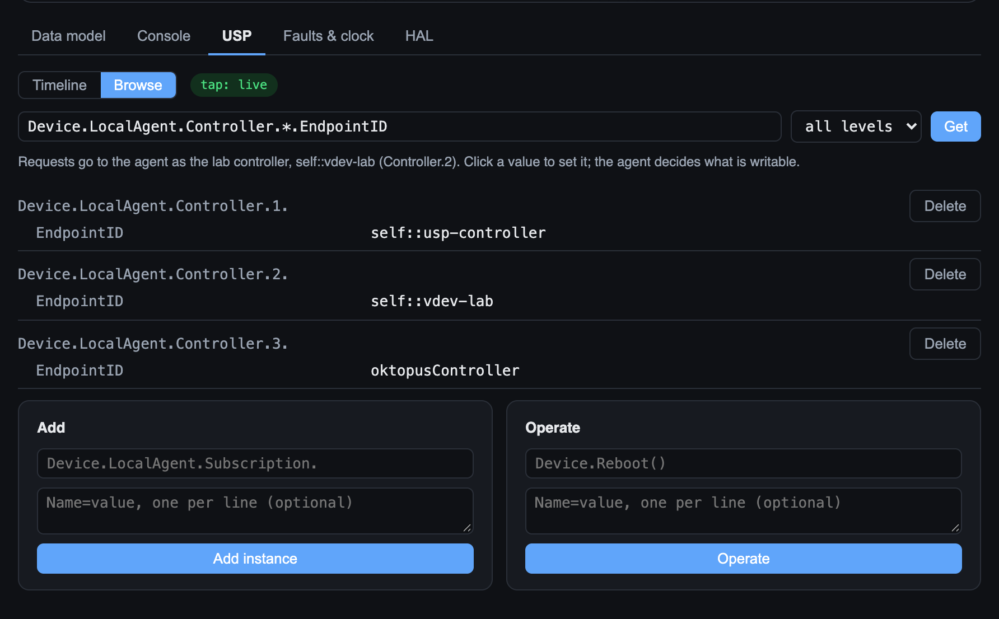
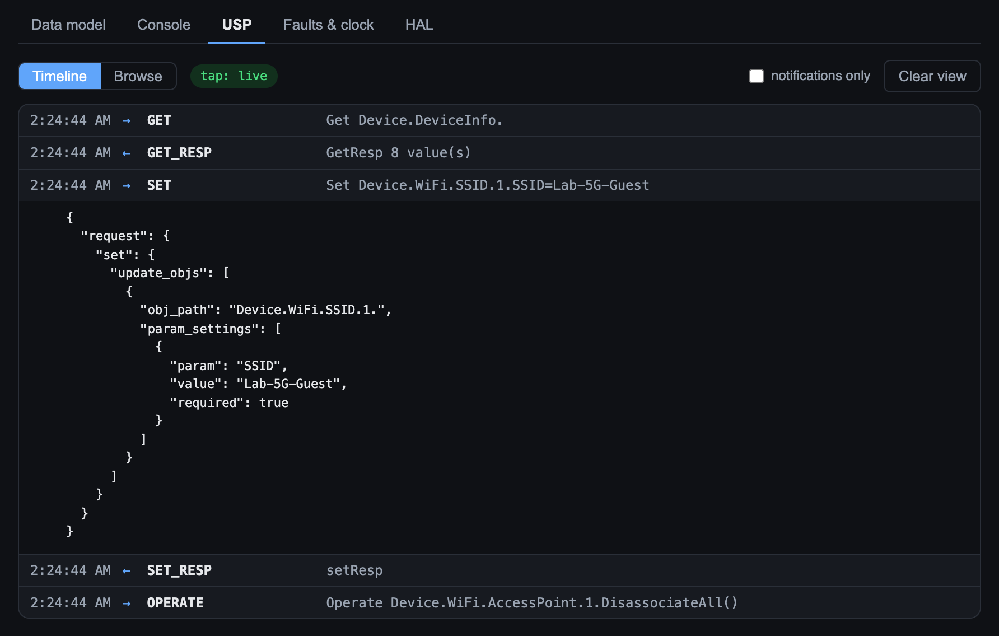
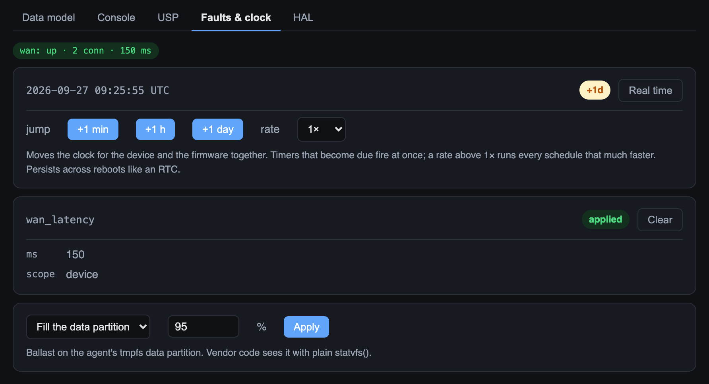
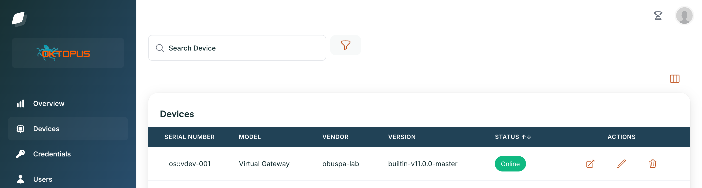

# obuspa-lab


A virtual CPE for TR-369 / USP development. A real, unmodified
[OB-USP-AGENT](https://github.com/BroadbandForum/obuspa) runs against
simulated hardware you can see and handle in the browser — so developing and
testing a gateway's management plane, or your own code inside the agent, does
not need a board, a card reader, or a power strip.

```
 your plug-ins  ──┐
 your obuspa tree ┼─▶ agent container ("firmware")  ◀── faults: disk, WAN link, latency · clock
 our proxy plugin ┘        │  console · USP tap
                           │ Unix socket
                    device container ("hardware")   ◀── 3D device, data model, HAL
                           │ WAN relay
                    broker ◀──▶ USP controllers (the pytest one, the lab's own, yours, Oktopus)
```

**What you get**

- **A real agent.** obuspa, pinned to a release, talking protobuf USP records
  over MQTT to a real broker. Nothing about the protocol is mocked.
- **A device with behaviour.** 79 TR-181 parameters across 12 objects — WiFi
  radios, SSIDs, access points and their clients, Hosts, IP, Ethernet, a
  firewall, Cellular with a removable SIM. Disabling a radio takes its SSIDs down and
  drops its clients; the other radio carries on. Sync and async commands.
- **A device you can handle.** A 3D gateway with LEDs that follow state, a
  reset button (press: reboot; hold: factory reset), a SIM slot, and an SD
  card slot. Reboots are real: the agent process exits and restarts, and a
  subscribed controller gets `Boot!`.
- **An SD card.** `make flash SRC=~/obuspa` compiles *your* obuspa tree onto
  it; seat it, press reset, and the device boots your binary. Booting upstream
  v10 on a v11 device is one of the tests.
- **Your code, on the platform.** `make flash PLUGINS=path/to/my-plugin`
  builds your obuspa plug-in — a data model, a background thread, whatever
  your firmware carries — against the tree the card will boot. Your logic acts
  on the simulated hardware through the same data model calls it makes on a
  real device. The platform never learns what your code does; your code never
  learns it is on the platform. See
  **[docs/vendor-integration.md](docs/vendor-integration.md)**.
- **Ways to stimulate it.** Environment faults with no code changes — fill
  the data partition (`statvfs()` sees it), cut the WAN, add latency —
  persisted and re-applied on every boot. A lab clock that jumps the
  firmware's time or runs it at up to 60×, so a day-long schedule finishes
  in seconds. An opt-in virtual HAL for code that reads hardware a container
  does not have.
- **Ways to observe it.** A serial console, a decoded USP timeline, a
  browser for the agent's data model as a controller sees it, and a Python
  USP controller you can write tests against.
- **A real controller, if you want one.** `make oktopus` runs
  [Oktopus](https://github.com/OktopUSP/oktopus), an open source USP
  controller, next to the lab and plugs it into the agent; any other
  controller attaches the same way.

**Two scenarios it exists for**, each a worked example with tests.
`examples/disk-monitor/`: a vendor thread does `statvfs()` on `/data`; the
lab fills it to 95 %; `SpaceLow!` arrives at the controller; reboot with the
disk still full and it alarms again. `examples/parental-controls/`: a
controller adds a vendor rule naming a client; the vendor's thread writes a
firewall rule; the device takes the client offline; the rule survives a
reboot and blocks the client when it reassociates.

## A look around

**USP › Browse** — the agent's data model as a controller sees it, including
everything obuspa serves itself. Here, the three controllers the agent knows:
the test suite, the lab, and Oktopus.



**USP › Timeline** — every record between the agent and its controllers,
decoded; click one for the full message.



**Faults & clock** — a 150 ms WAN latency fault applied, and the clock a day
ahead for the device and the firmware alike.



**Oktopus** — the lab device in a real controller's inventory, after
`make oktopus`.



## Quick start

Requires Docker (Docker Desktop or Engine; on macOS, Docker Desktop or
colima) and Python 3.11+ for the tests.

```bash
make up      # pull the prebuilt images and start broker + agent + device
make test    # run the suite against it
make logs    # follow all three services
```

`make up` pulls images published from this repository (`ghcr.io/mooazn/obuspa-lab/{agent,device}`,
amd64 and arm64). To build them from the working tree instead — after
changing the plug-in, the device, or the agent's entrypoint — use `make dev`;
the first build compiles obuspa from source and takes a few minutes.

Open <http://localhost:8080>. Drag to orbit the device; change the SSID in
the tree and read it back over USP; press reset and watch it boot.
If 8080 is taken on your machine, `make up VDEV_HTTP_HOST_PORT=8081` (and
the same variable for `make dev` and `make test`) moves it.

`make down` stops the stack; `make reset` also wipes the agent database — a
factory reset.

### Flashing a build onto the SD card

```bash
make flash SRC=~/src/obuspa                     # a checkout you have been editing
make flash REF=v10.0.0-master                   # any upstream git ref
make flash PLUGINS="examples/disk-monitor"      # your plug-in(s), built-in obuspa
make flash SRC=~/obuspa PLUGINS="./my-plugin"   # both: plug-in built against your tree
make eject                                      # wipe the card
```

`flash` compiles in the agent image's own build stage (dependencies cached),
compiles plug-ins against *that* tree's headers, and exports everything into
`./sdcard/`. Seat the card in the 3D view and press reset. The tag in the
corner of the viewport says what booted — and warns if the card in the slot
is not what is running.

Compiling plug-ins against the flashed tree is not decoration: obuspa's
vendor API moves between releases, and this catches it before a device does.

## Status and expectations

Early. Tested on macOS with Docker Desktop against obuspa v11.0.0; Linux
should work unchanged. The broker and the web UI are unauthenticated by
design — this is a local lab, not something to expose. The SD card boots
whatever you flashed onto it.

Not affiliated with the Broadband Forum. See [THIRD_PARTY.md](THIRD_PARTY.md)
for what this builds on.

Next: a TR-181 `FirmwareImage` state machine with per-stage fault injection,
ValueChange notifications, and running many devices at once.

## How it fits together

### The device owns the state

`device/vdev/core.py` is the virtual device. It knows nothing about USP — it
deals in native Python values and data model paths. Management protocols attach
to it as adapters. That boundary is deliberate: a TR-069/CWMP adapter could be
added later without touching the device, and it keeps device behaviour (state
machines, timing, fault injection) in Python where it is pleasant to write.

`device/vdev/model.py` declares what the device exposes — objects,
parameters, commands, validation, and the cross-object behaviour. It is the
single source of truth: the agent asks for this model at startup and registers
whatever it finds. **Growing the data model is a pure-Python change** — no C,
no recompiling, no obuspa fork.

Instance numbers are the one subtle part. Objects nest, and the instance space
is *jagged*: `AccessPoint.1` may have three clients while `AccessPoint.2` has
none. So each row is keyed by the full tuple of instance numbers in one flat
dict per schema, and "a parent with no children" is simply a prefix with no
matching keys — deliberately distinct from a parent that does not exist. Path
resolution tries the deepest schema first, or `Device.WiFi.AccessPoint.{i}`
would happily swallow `AccessPoint.1.AssociatedDevice.1.MACAddress` and call
the remainder a parameter name.

### How a reboot works

`Device.Reboot()` is obuspa's own command. The plug-in registers a core vendor
hook for it, which tells the device to reboot and then calls `_exit(0)`.

That last part matters twice over. obuspa explicitly permits a reboot hook to
either return or exit the process itself — but returning *deadlocks* here,
because obuspa's `exit(0)` runs atexit handlers while the plug-in's event
thread is still blocked reading the device socket. `_exit()` skips all of that,
and is a better model of a device losing power anyway: nothing gets tidied up.

The device meanwhile unlinks its Unix socket for `VDEV_REBOOT_SECONDS`, so the
restarted agent waits for its data model provider to come back exactly as it
would wait for real hardware.

Reboots that start on the *device* side — the reset button, a factory reset,
later a firmware activation — never go through USP at all. For those, the
plug-in's event thread does the work: once it has been connected to the device
and the connection goes away, it exits the agent, on the principle that the
agent is the device's firmware and does not outlive the device. The container
restarts it, and the controller sees the same disconnect / reconnect / `Boot!`
sequence as for `Device.Reboot()`.

On the way up, `agent/entrypoint.sh` acts as the bootloader: it honours a
pending factory-reset marker by wiping the agent database, picks the SD card
image if the device has the card seated, and writes `booted-from.json` so the
UI can say what is running.

### The plug-in is a dumb pipe

obuspa does not implement `Device.WiFi.*`, `Device.Hosts.*` or any other
concrete TR-181 subtree — it implements the administrative model
(`Device.LocalAgent.*`, `Device.Controller.*`, `Device.MTP.*`,
`Device.Subscription.*`, `Device.Security.*`, parts of `Device.DeviceInfo.*`).
Everything else is the integrator's job.

The supported way to do that job is obuspa's *grouped parameter API*, which
exists precisely for the case where "the data model is implemented by other
executables (called 'data model provider components')". `plugin/vdev_plugin.c`
implements that: it registers whatever model the device describes, and forwards
every get/set/add/delete over a Unix socket as newline-delimited JSON. It is
~500 lines, it contains no device logic, and it should essentially never change.

It is loaded with obuspa's `-x` plug-in option, so obuspa itself is used
unmodified, pinned to a release tag.

### The controller is standards-based

`controller/uspctl/` is a small USP controller: protobuf USP Records over MQTT 5,
request/response correlation by `msg_id`. The schemas in `controller/usp_proto/`
are the Broadband Forum originals from [BroadbandForum/usp][usp], renamed only
because Python can't import module names with dashes in them.

This exists instead of [obuspa-test-controller][testctrl] because that tool
replays messages from files and prints responses, which is awkward to assert
against. Here a test reads:

```python
controller.set({"Device.WiFi.SSID.1.SSID": "RoundTrip"})
assert controller.get_one("Device.WiFi.SSID.1.SSID") == "RoundTrip"
```

[usp]: https://github.com/BroadbandForum/usp
[testctrl]: https://github.com/BroadbandForum/obuspa-test-controller

## Layout

```
agent/        obuspa + plug-in image, the bootloader-like entrypoint, the
              factory reset config, and Dockerfile.flash for the SD card
sdcard/       the SD card: `make flash` writes obuspa + plug-in + manifest here
plugin/       the C shim: grouped vendor hooks -> Unix socket JSON
device/       the virtual device: model, state, faults, WAN relay, web UI, 3D scene
examples/     disk-monitor, parental-controls: worked vendor plug-ins
docs/         vendor-integration.md — the contract for bringing your own code
controller/   USP controller and the BBF protobuf schemas
controllers/  definitions of other controllers the agent can be plugged into
oktopus/      how `make oktopus` runs Oktopus: compose override, nginx config
tests/        the suite, run from the host against the stack
mosquitto/    broker config
```

## Notes and limits

- **Value changes still propagate on demand, not by push.** obuspa queries the
  device when a controller asks, so a change made in the browser is what the
  *next* Get returns. Events and operation results *are* pushed (that is what
  the plug-in's event thread is for), but ValueChange notifications need
  `USP_REGISTER_SubscriptionVendorHooks` and are not wired up yet.
- **Persistent subscriptions outlive the process.** They live in the agent's
  database, so a controller that creates one and goes away leaves obuspa
  retrying notifications at nobody. The test fixtures delete theirs on the way
  out; `make reset` clears everything.
- **The factory reset file only applies to a fresh database.** obuspa ignores
  `agent/factory_reset.txt` if a database already exists, so edits to MQTT
  topics or endpoint IDs need `make reset` to take effect.
- **The broker is wide open.** Anonymous, unencrypted, fine for a local lab and
  nothing else.
